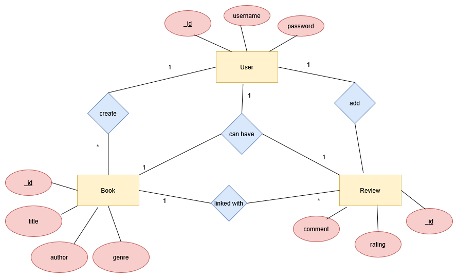

# book-reviews-api

A RESTful API built with Node.js, Express, and MongoDB for managing book reviews, user authentication, and related data.

## Project Setup Instructions

**1. Clone the repository**
```bash
git clone https://github.com/renurao1306/book-reviews-api.git
cd book-reviews-api
```

**2. Install Dependencies**
```bash
npm install
```

**3. Setup environment variables**
Create a .env file in the root directory with the following content:
```bash
PORT=3000
MONGO_URI=YOUR_MONGO_CONNECTION_STRING/yourDatabaseName
JWT_SECRET=YOUR_SECRET_KEY
```

**4. Start the server**
Run the following command to start the server:
```bash
npm start
```

---


## Example API requests
**1. Register a new user**
Endpoint: POST /api/signup
Request Body:
```json
{
    "username": <your_username>,
    "password": <your_password>
}
```
Response:
```json
{
    "message": "User created successfully"
}
```

**2. Login**
Endpoint: POST /api/login
Request Body:
```json
{
    "username": <your_username>,
    "password": <your_password>
}
```
Response:
```json
{
    "token": <JWT_TOKEN>
}
```

**3. Create a new book**
Endpoint: POST /api/books
Authorization: Bearer Token - Add the token received in response of /api/login
Sample Request Body:
```json
{
    "title": "The magic of the Lost Temple",
    "author": "Sudha Murty",
    "genre": "Adventure Fiction"
}
```
Sample Response:
```json
{
    "title": "The magic of the Lost Temple",
    "author": "Sudha Murty",
    "genre": "Adventure Fiction",
    "reviews": [],
    "_id": "68418aed3338a9beb19f4b19",
    "__v": 0
}
```

**4. List all books and their details with pagination**
Endpoint: GET /api/books
Request Body:
```json
None
```
Sample Response:
```json
{
    "books": [
        {
            "_id": "684181580b49c0d6c3361097",
            "title": "Harry Potter and the Prisoner of Azkaban",
            "author": "J.K.Rowling",
            "genre": "Fiction",
            "reviews": [],
            "__v": 0
        },
        {
            "_id": "684181a20b49c0d6c3361099",
            "title": "The Adventures of Sherlock Holmes",
            "author": "Arthur Conan Doyle",
            "genre": "Mystery",
            "reviews": [],
            "__v": 0
        },
        {
            "_id": "684181db0b49c0d6c336109b",
            "title": "Sapiens: A Brief History of Humankind",
            "author": "Yuval Noah Harari",
            "genre": "Science",
            "reviews": [
                "68418ea89f046c796dbed62e"
            ],
            "__v": 0
        },
        {
            "_id": "6841826b0b49c0d6c336109d",
            "title": "The magic of the Lost Temple",
            "author": "Sudha Murty",
            "genre": "Adventure Fiction",
            "reviews": [],
            "__v": 0
        }
    ],
    "totalBooks": 4,
    "currentPage": 1,
    "totalPages": 1
}
```

**5. Fetch book details by id, including average rating and reviews with pagination**
Endpoint: GET /api/books/<BOOK_ID>
Request Body:
```json
None
```
Sample Respons:
```json
{
    "book": {
        "_id": "684181db0b49c0d6c336109b",
        "title": "Sapiens: A Brief History of Humankind",
        "author": "Yuval Noah Harari",
        "genre": "Science",
        "reviews": [
            {
                "_id": "68418ea89f046c796dbed62e",
                "book": "684181db0b49c0d6c336109b",
                "user": "684150a5596d5d331eb924b3",
                "rating": 3,
                "comment": "Informative and lucid language used throughout the book",
                "createdAt": "2025-06-05T12:33:44.275Z",
                "updatedAt": "2025-06-05T12:33:44.275Z",
                "__v": 0
            }
        ],
        "__v": 0
    },
    "avgRating": 3,
    "reviews": [
        {
            "_id": "68418ea89f046c796dbed62e",
            "book": "684181db0b49c0d6c336109b",
            "user": "684150a5596d5d331eb924b3",
            "rating": 3,
            "comment": "Informative and lucid language used throughout the book",
            "createdAt": "2025-06-05T12:33:44.275Z",
            "updatedAt": "2025-06-05T12:33:44.275Z",
            "__v": 0
        }
    ],
    "currentPage": 1,
    "totalPages": 1
}
```

**6. Submit a review (One authenticated user can submit only one review for a particular book)**
Endpoint: POST /api/books/<BOOK_ID>/reviews
Authorization: Bearer Token - Add the token received in response of /api/login
Sample Request Body:
```json
{
    "rating": 3.0,
    "comment": "Informative and lucid language used throughout the book"
}
```
Sample Response:
```json
{
    "book": "684181db0b49c0d6c336109b",
    "user": "684150a5596d5d331eb924b3",
    "rating": 3,
    "comment": "Informative and lucid language used throughout the book",
    "_id": "68418ea89f046c796dbed62e",
    "createdAt": "2025-06-05T12:33:44.275Z",
    "updatedAt": "2025-06-05T12:33:44.275Z",
    "__v": 0
}
```

**7. Update review (Each user can update only their review)**
Endpoint: PUT /api/reviews/<REVIEW_ID>
Authorization: Bearer Token - Add the token received in response of /api/login
Sample Request Body:
```json
{
    "rating": 3.5,
    "comment": "An absolute thriller!"
}
```
Sample Response:
```json
{
    "message": "Review updated successfully",
    "review": {
        "_id": "68418ea89f046c796dbed62e",
        "book": "684181db0b49c0d6c336109b",
        "user": "684150a5596d5d331eb924b3",
        "rating": 3.5,
        "comment": "An absolute thriller!",
        "createdAt": "2025-06-05T12:33:44.275Z",
        "updatedAt": "2025-06-05T14:17:10.771Z",
        "__v": 0
    }
}
```

**8. Delete a review (Each user can only delete their own review)**
Endpoint: DELETE /api/reviews/<REVIEW_ID>
Authorization: Bearer Token - Add the token received in response of /api/login
Request Body:
```json
None
```
Sample Response:
```json
{
    "message": "Review deleted successfully"
}
```

**9. Search a book by title or author**
Endpoint: GET /api/search?query=<TITLE_OR_AUTHOR_NAME>
Request Body:
```json
None
```
Sample Response:
```json
{
    "books": [
        {
            "_id": "684181580b49c0d6c3361097",
            "title": "Harry Potter and the Prisoner of Azkaban",
            "author": "J.K.Rowling",
            "genre": "Fiction",
            "reviews": [],
            "__v": 0
        }
    ]
}
```


---


## Design Decisions & Assumptions

- JWT Authentication is used to protect private routes.

- bcrypt hashes passwords for security.

- Each user can post one review per book (optional enhancement).

- MongoDB is used for its flexibility and document-based schema.


---


## Brief Schema Design

**1. Users Schema**
```json
{
  _id: ObjectId,
  username: String (unique, required),
  password: String (hashed, required)
}
```

**2. Books Schema**
```json
{
  _id: ObjectId,
  title: String (required),
  author: String (required),
  genre: String (required),
  reviews: [ObjectId] // Array of Review references
}
```

**3. Reviews Schema**
```json
{
  _id: ObjectId,
  book: ObjectId (ref: 'Book', required),
  user: ObjectId (ref: 'User', required),
  rating: Number (1–5, required),
  comment: String (optional),
  createdAt: Date,
  updatedAt: Date
}
```

**Relationships**

- A User can create multiple Reviews.

- A Book can have multiple Reviews.

- Each Review is linked to exactly one User and one Book.

- A User can review a Book only once.

**ER Diagram**


